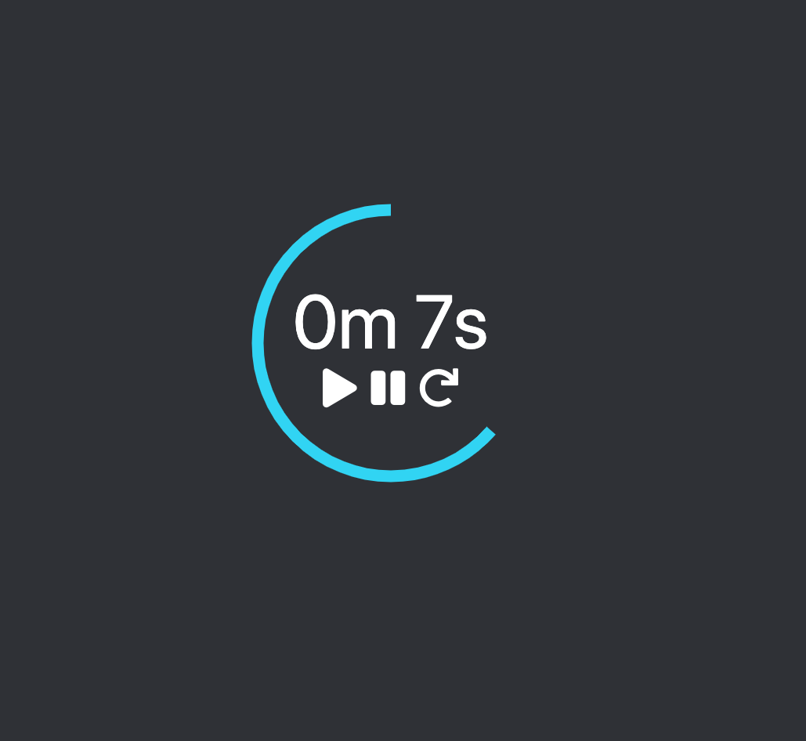

# Colour Timer
A timer app built using JavaScript classes and a bit of Jquery UI/CSS.

Extended from an exercise in the [The New Modern Javascript Bootcamp](
https://www.udemy.com/course/javascript-beginners-complete-tutorial/)

## Features

- Live conversion of input value from minutes to seconds.
- Groovy mood-ring shows countdown to zero
- Minimal interface for all your in-browser timing needs

Live demo [here](https://www.liamfpower.com/colourtimer)

## License

Distributed under the MIT License. See LICENSE for more information.

